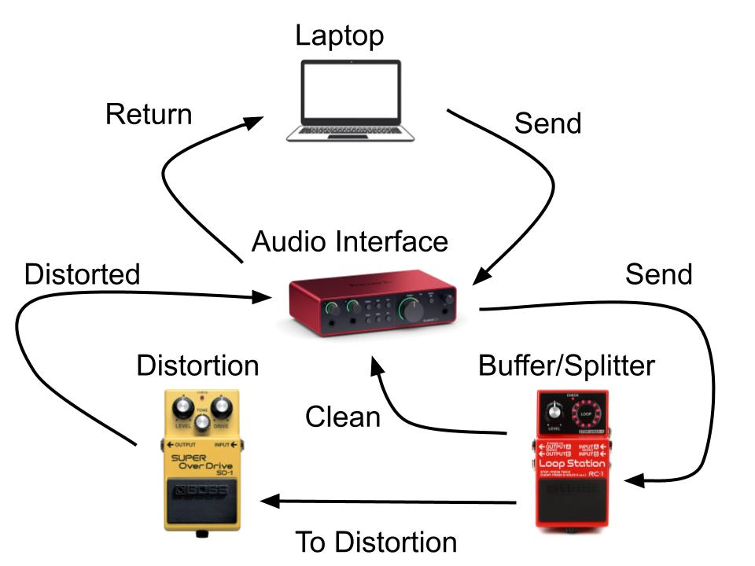

# DataGeneration
How to Create Train/Val/Test Data

## Overview
CreateMono.py converts Stereo to Mono.

PlayRecMono.py takes Mono files, and plays them through a Buffer Splitter (Boss RC-1 in this case), sending one signal to the Effect and the other signal directly to be recorded.

Both Dry and Wet signals are recorded at the same time so there is no latency between them.

## Set Up

