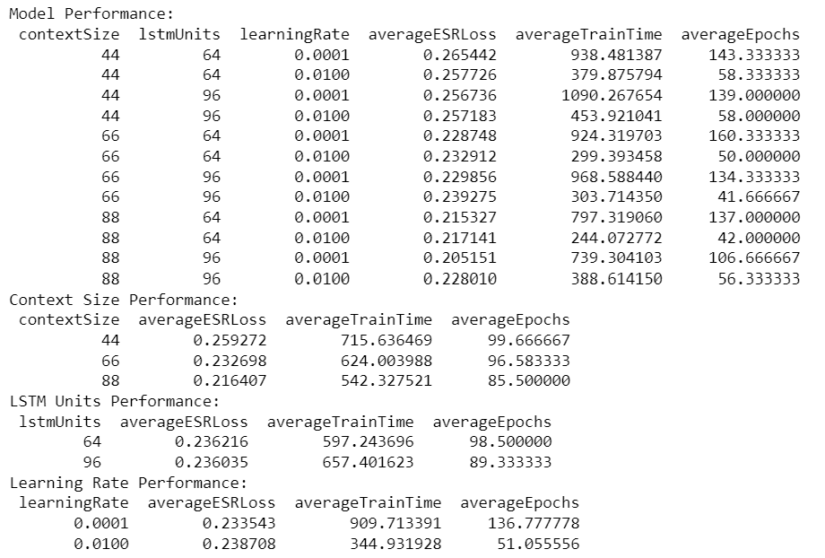

# DSL20HPreamp/UltraGain
Marshall DSL20H Preamp Modelling on the UltraGain Channel

**Experiment #3**

## Overview
This is the first experiment with modelling a tube amplifier. 

This experiment aimed to model a Marshall DSL20H Preamp at varying gain levels, with the same model architecture and hyperparameters as [SD-1/DS340](../../../WriteUps/SD-1/DS340/README.md) to compare model performance in modelling a tube amp vs a solid-state pedal circuit.

This experiment specifically modelled the preamp section of the DSL20H, as I didn't have a load box or a way to attenuate the power amp. To record the output of the preamp, the signal was taken from FX Loop Send.

## Recording Settings
- Dry signals recorded at 20dB input at 44.1K Hz on Focusrite Scarlett 2i2 Gen 4
- Wet signals recorded at 15dB input at 44.1K Hz on Focusrite Scarlett 2i2 Gen 4
- Reverb, Resonance, and Presence knobs at 0
- EQ knobs at at 5
- Tone Shift off
- Ultra Gain Channel On
- Volume at 10
- Low Gain: Gain at 2
- Mid Gain: Gain at 5
- High Gain: Gain at 8

**Note: Resonance/Presence Knobs are part of the Power Amp circuit, and therefore have no effect on Preamp output.**

[Recordings](../../../Data/DSL20HPreamp/UltraGain)

[Recording Set Up](../../../DataGeneration)

## Training/Validation Data
Data was split into context chunks WITH NO overlap. The x data was a single chunk of dry audio with size n, and the y data was the corresponding wet audio output sample.

[Training/Validation Data](../../../TrainValPickles/DSL20HPreamp/UltraGain)

## Model Architecture
All models consisted of a single LSTM layer, fed into a single Dense layer.

## Hyperparameters
These hyperparameter combinations resulted in 36 models. 

Variable Hyperparameters:
  - Gain Levels on Marshall DSL20H Preamp: "Low", "Mid", "High"
  - Training/Validation Data Context Sizes: 44, 66, 88 samples (Corresponding to 1, 1.5, and 2 ms with a sample rate of 44.1K)
  - LSTM Hidden Unit Sizes: 64 and 96 units
  - Model Learning Rates: 0.01 and 0.0001

Fixed Hyperparameters:
  - Patience/Early Stopping: 15
  - Batch Size: 64
  - Epochs: 200
  - Training Data Shuffled: True
  - Random State: 25
  - Sample Rate: 44.1K
  - All models trained on approximately 75K data samples relative to Context Size
  - Adam Optimizer used
  - Loss Function: ESR Loss

**Note: Number of Epochs was increased to 200 to allow models more time to converge. This appeared to be a limiting factor with [SD-1/DS340](../../../WriteUps/SD-1/DS340/README.md).**

## Metrics
ESR loss (Error to Signal Ratio) was used as the loss function for all models. MSE and MAE were also observed as well.

## Testing Data
All models were tested on [battery.wav](../../../Data/Inputs/battery.wav), [electricEye.wav](../../../Data/Inputs/electricEye.wav), [holywar.wav](../../../Data/Inputs/holywar.wav), [ohwell.wav](../../../Data/Inputs/ohwell.wav), [sanitarium.wav](../../../Data/Inputs/sanitarium.wav), and [shadowlove.wav](../../../Data/Inputs/shadowlove.wav). These were chosen for their diversity in speed and complexity. It also would take too long to test all 36 models on all of the song samples. ESR loss for the model's predictions vs the true DSL20H Preamp's output was saved. The output audio files were also saved.

## Results
All Results:

Summarized Hyperparameter Results:

## Conclusions
Unfortunately, all of the models performed extremely poorly. During testing, ESR Loss ranged from 15-30%. Even though models were given 200 epochs to converge (an increase from 100 in [SD-1/DS340](../../../WriteUps/SD-1/DS340/README.md)), the models' ability to mimic the DSL20H Preamp at UltraGain settings was extremely poor. The initial listening tests also revealed a noticeable difference between the predicted and expected outputs. As for the hyperparameters, increasing context size yielded better accuracy, which is consistent with the findings in [SD-1/DS340](../../../WriteUps/SD-1/DS340/README.md) and [SD-1/ContextExperiments](../../../WriteUps/SD-1/ContextExperiments/README.md). Consistent with the results from [SD-1/DS340](../../../WriteUps/SD-1/DS340/README.md), there is negligible difference between having 64 vs 96 LSTM units.

From the summary, the accuracy difference between models with learning rates of 0.01 and 0.0001 is negligible when fully allowed to converge (at least for the testing data). However, when looking at the Training vs Validation Loss graphs, an interesting pattern appears. 

Training vs Validation Loss Graphs for All Models:

**Note: I apologize for the poor graph. There's 36 models, this is the best I could come up with quickly.**

From the graphs, it can be seen that the models in the first, third, and fifth columns experience large, unpredictable spikes in training and validation loss during training. These graphs correspond to models with a learning rate of 0.01. The models in the second, fourth, and sixth columns are much smoother and correspond to models with a learning rate of 0.0001.

All of the models experienced a decent amount of instability compared to the models from [SD-1/DS340](../../../WriteUps/SD-1/DS340/README.md).

Although the models with a learning rate of 0.0001 had a smoother convergence, their increase in accuracy was not very steep, and was less so than [SD-1/DS340](../../../WriteUps/SD-1/DS340/README.md), indicating that the models still struggled to learn the effect. 

As for the difference in accuracy between models with a learning rate of 0.01 and 0.0001, there seemed to be very little difference between models with the exact same hyperparameters besides learning rate. For example, models 6 and 7. 

Model 6 and Model 7 Results:

Model 6 (0.01 Learning Rate) Train Val Loss Graph:

Model 7 (0.0001 Learning Rate) Train Val Loss Graph:

From both models, the difference in accuracy for all test riffs is < 1%. However, the training for Model 7 was much smoother. 

Given that all models performed poorly, it became necessary to look at the waveforms to try and see where the models were messing up. My initial hypothesis was that the models struggled to learn due to random noise from the DSL20H Preamp. The preamp is tube driven, which by the nature of the tecehnolgy is prone to random noise, especially when nothing is being played. It occurred to me that it was possible that the models were learning how to distort music signals accurately, but was messing up on the random noise. To check this, I graphed waveforms from Model 35 from various parts of [shadowlove.wav](../../../Data/Inputs/shadowlove.wav). 

Beginning Noise Chunk:

This first graph (Beginning Noise Chunk) was taken from the beginning of the riff, where there was noise and silence. This graph shows that the model completely fails to predict and model the noise from the preamp. An interesting thing to note is that in the first few samples where there is no audio, and the signals are a horizontal line, the model predicts the silence at a higher amplitude than the actual input and output.

Music Chunk 1:

Music Chunk 2:

As for these music chunks, the models show more promise in modelling the music distortion. The waveforms are not as tightly matched as [SD-1/DS340](../../../WriteUps/SD-1/DS340/README.md) and [SD-1/ContextExperiments](../../../WriteUps/SD-1/ContextExperiments/README.md), but they follow the general pattern which is promising. These results indicate that the models are poorly equipped to handle noise, but still show promise in modelling the actual musical elements of the signals. Therefore, the models need to be expanded to handle noise in some way, whether that be a noise gate different recording techniques, more layers, etc.

## Takeaways
