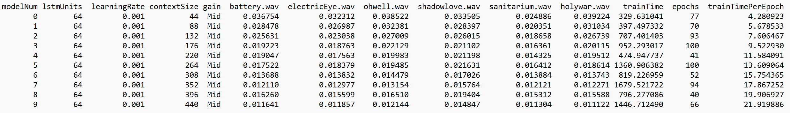
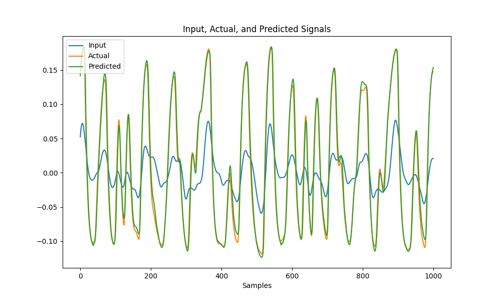
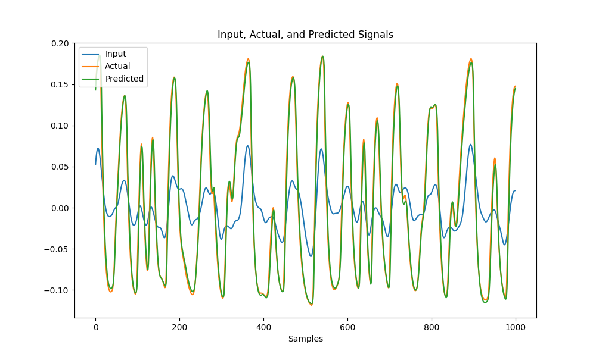
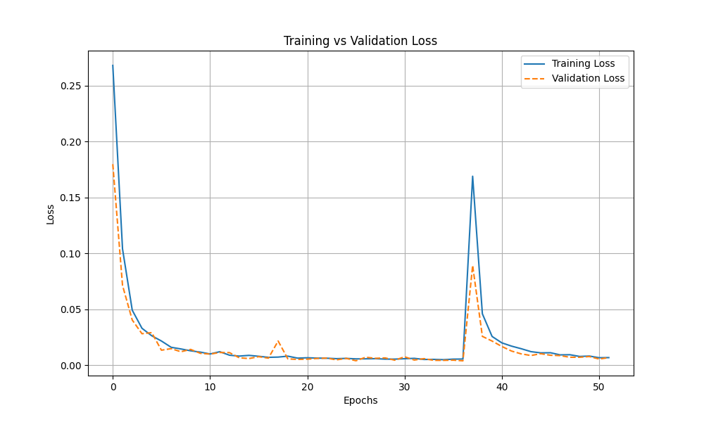
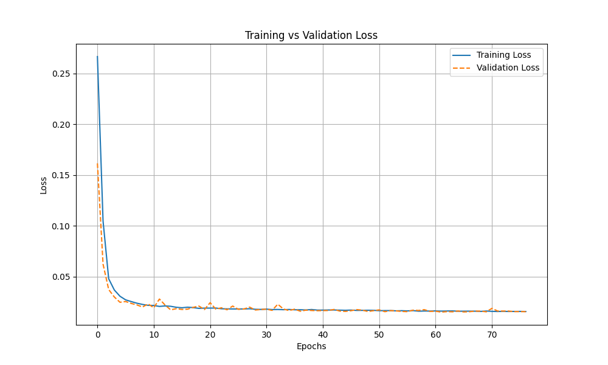
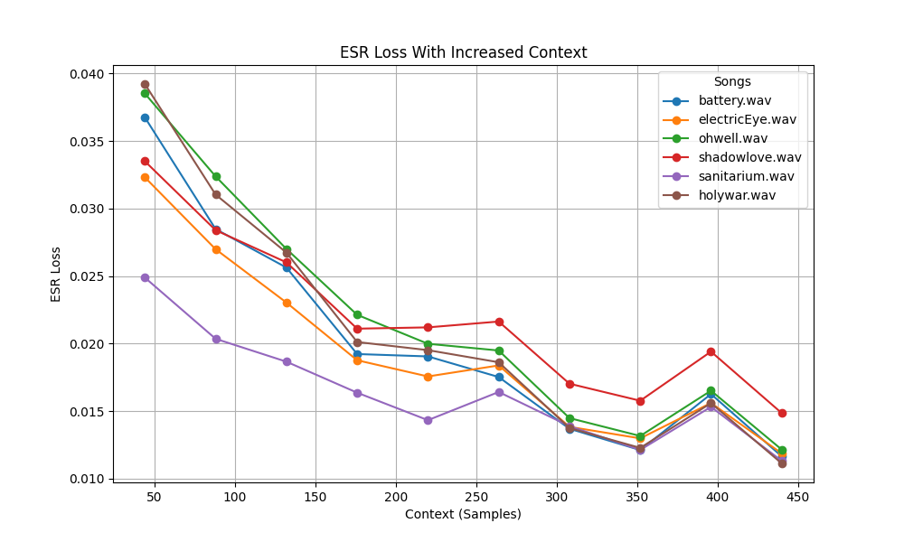
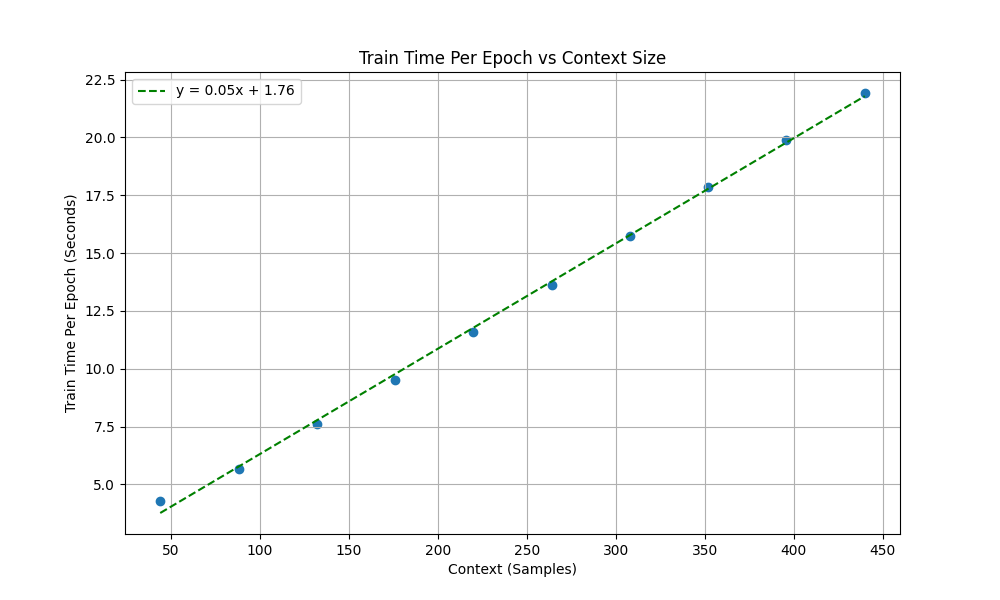

# SD-1/ContextExperiments
Boss SD-1 Modelling with Experiments Adjusting the Context Size Hyperparameter

## Overview
This was the first continuation of the project from [SD-1/DS340](../../../WriteUps/SD-1/DS340/README.md). The results from SD-1/DS340 indicated that increasing context size for the models to learn from might improve performance. This experiment centered around training models with the same hyperparameters on increasing levels of context to see how well they would perform.

## Recording Settings

- Dry and Wet signals recorded at 20dB input at 44.1K Hz on Focusrite Scarlett 2i2 Gen 4
- Tone and Level knobs at Noon
- Mid Gain: Drive at 12:00

The recordings used for this dataset were the same recordings used for SD-1/DS340: [Recordings](../../../Data/SD-1/DS340)
    
## Training/Validation Data 
Data was split into context chunks of size n WITH overlap. The x data was a single chunk of dry audio with size n, and the y data was the corresponding wet audio output sample.

Context chunk overlap was included when creating the x data because at higher contexts, there weren't enough samples in the audio to create a large enough dataset with no overlap. 100000 x y pairs were randomly sampled from all of the chunks generated. 75% of those pairs were used for training, and 25% for validation.

[Training/Validation Data](../../../TrainValPickles/SD-1/ContextExperiments)

## Model Architecture
All models consisted of a single LSTM layer, fed into a single Dense layer.

## Hyperparameters
These hyperparameter combinations resulted in 10 models. 

Variable Hyperparameters:
  - Training/Validation Data Context Sizes: 44, 88, 132, 176, 220, 264, 308, 352, 396, and 440 samples (Corresponding to 1-10ms with a sample rate of 44.1K)

Fixed Hyperparameters:
  - Gain Level on Boss SD-1: "Mid"
  - LSTM Hidden Unit Size: 64
  - Model Learning Rate: 0.001
  - Train Data Size: 75000
  - Validation Data Size: 25000
  - Patience/Early Stopping: 15
  - Batch Size: 64
  - Epochs: 100
  - Training Data Shuffled: True
  - Random State: 25
  - Sample Rate: 44.1K
  - Adam Optimizer used
  - Loss Function: ESR Loss

## Metrics
ESR loss (Error to Signal Ratio) was used as the loss function for all models. MSE and MAE were also observed as well.

## Testing Data
All models were tested on [battery.wav](../../../Data/Inputs/battery.wav), [electricEye.wav](../../../Data/Inputs/electricEye.wav), [holywar.wav](../../../Data/Inputs/holywar.wav), [ohwell.wav](../../../Data/Inputs/ohwell.wav), [sanitarium.wav](../../../Data/Inputs/sanitarium.wav), and [shadowlove.wav](../../../Data/Inputs/shadowlove.wav). ESR loss for the model's predictions vs the true SD-1 output was saved. The output audio files were also saved.

## Results
All Results:

## Conclusions
Overall, the experiment was very successful, as the results indicated that increasing context size for the same model architecture will improve modeling results. For the more complex riffs like holywar.wav and shadowlove.wav, going from 44 samples (1ms) to 440 (10ms) of context improved modeling accuracy by 2-3%. This improvement can be seen when graphing the expected output, and model output of the waveforms for the riffs. Below are the waveform graphs for shadowlove.wav at 1ms of context, and 10ms of context.

shadowlove.wav with 44 Samples (1ms) of Context:

shadowlove.wav with 440 Samples (10ms) of Context:

The improvement between the models can mostly be seen in the peaks and troughs of the waveform, with the higher context models more closely matching the actual output.

Training for the models was stable for almost all models. However, there was a point of instability when training Model 6 with 308 samples (7ms) of context. However, all other models converged without instability.

Model 6 (308 samples, 7ms) Train Val Loss Graph:

Model 9 (440 samples, 10 ms) Train Val Loss Graph (All other models had similar graphs):

One thing worth noting is that the accuracy gains from increasing context size appear to diminish exponentially as context size increases linearly. This creates a limitation in which at a certain point, it is practically pointless to increase context size to improve model performance. In fact, it might be the case that after a certain point, model performance will decrease instead.

ESR Loss vs Context Size per Test Riff Results:

Another thing worth noting during training was training time duration and epochs. All models were given 100 epochs to converge with a early stopping patience of 15. From the results, it appears that the number of epochs needed to converge isn't necessarily correlated with increasing context size. However, train time per epoch increased with the increase in context size. This increase appears to be linear, indicating that there is eventually a practical limit to how much one can increase context size, especially considering that the accuracy improvements diminish with increased context, and are very small by comparison. In addition to increased train time per epoch, there are memory constraints in training and running models that take larger context sizes. Larger context sizes mean more audio samples per data sample in a dataset. Although there are benefits to increasing context size to improve model accuracy, there are a few significant practical restraints in terms of time and computation.

Train Time Per Epoch vs Context Size:

In the listening test, the model outputs were extremely similar to the true output, as was the case with [SD-1/DS340](../../../WriteUps/SD-1/DS340/README.md). There were some extremely minor artifacts, but some of the artifacts were due to some Focusrite 2i2 bugs during recording. It is worth noting that the output between Model 0 (44 samples, 1ms) and Model 9 (440 samples, 10ms) were also extremely similar, bringing into question whether increasing context size brings a meaningful listening improvement rather than purely based on ESR Loss.

## Takeaways

The experiment was successful, indicating that increasing context size can yield accuracy benefits to modelling. However, there are time and computation constraints that users need to be aware of.

Other model architectures need to be explored, and the effect of increasing context size needs to experimented with on them.

Although context size based models perform well, for variable sample rates, there are limitations to them. Models that are not based on context, or that can adjust their context size based on the sample rate of the audio should be explored.

Methodologies need to be explored to reduce artifacts and for other analysis. Purely basing a model's performance on ESR loss may lead to misleading results and models that perform worse in reality to listeners.

Methodologies need to be explored to determine statistically significant hyperparameters and model performance. Currently I'm making assumptions based on the data I'm seeing, as well as using basic graphical analysis.
