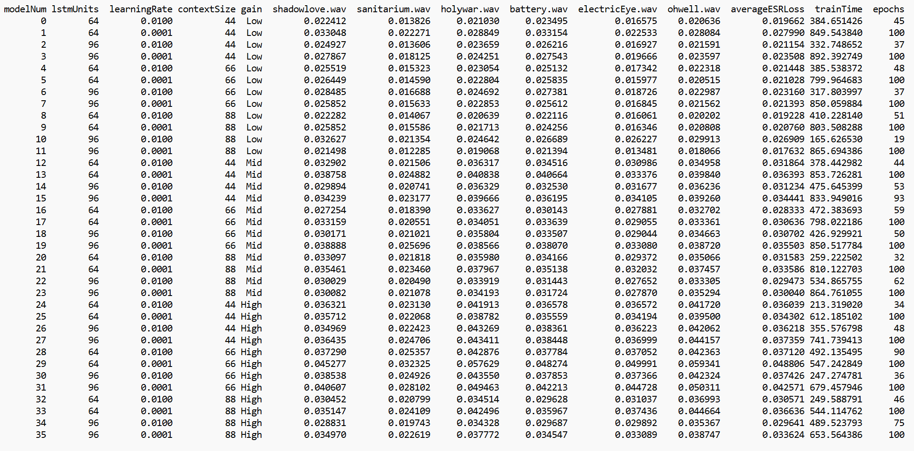
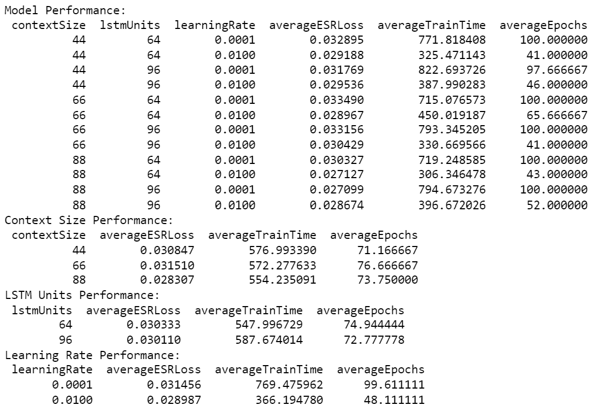

# SD-1/DS340
Boss SD-1 Modelling for DS340

## Overview
This was the first experiment of this project for my DS340 class.

This experiment aimed to model a Boss SD-1 at varying gain levels, but also to see how different model hyperparameters would influence modelling accuracy.

## Recording Settings

- Dry and Wet signals recorded at 20dB input at 44.1K Hz on Focusrite Scarlett 2i2 Gen 4
- Tone and Level knobs at Noon
- Low Gain: Drive at 9:00
- Mid Gain: Drive at 12:00
- High Gain: Drive at 3:00

[Recordings](../../../Data/SD-1/DS340)

[Recording Set Up](../../../DataGeneration)

## Training/Validation Data 
Data was split into context chunks of size n WITH NO overlap. The x data was a single chunk of dry audio with size n, and the y data was the corresponding wet audio output sample.

[Training/Validation Data](../../../TrainValPickles/SD-1/DS340)

## Model Architecture
All models consisted of a single LSTM layer, fed into a single Dense layer.

## Hyperparameters
These hyperparameter combinations resulted in 36 models. 

Variable Hyperparameters:
  - Gain Levels on Boss SD-1: "Low", "Mid", "High"
  - Training/Validation Data Context Sizes: 44, 66, 88 samples (Corresponding to 1, 1.5, and 2 ms with a sample rate of 44.1K)
  - LSTM Hidden Unit Sizes: 64 and 96 units
  - Model Learning Rates: 0.01 and 0.0001

Fixed Hyperparameters:
  - Patience/Early Stopping: 15
  - Batch Size: 64
  - Epochs: 100
  - Training Data Shuffled: True
  - Random State: 25
  - Sample Rate: 44.1K
  - All models trained on approximately 75K data samples relative to Context Size
  - Adam Optimizer used
  - Loss Function: ESR Loss

## Metrics
ESR loss (Error to Signal Ratio) was used as the loss function for all models. MSE and MAE were also observed as well.

## Testing Data
All models were tested on [battery.wav](../../../Data/Inputs/battery.wav), [electricEye.wav](../../../Data/Inputs/electricEye.wav), [holywar.wav](../../../Data/Inputs/holywar.wav), [ohwell.wav](../../../Data/Inputs/ohwell.wav), [sanitarium.wav](../../../Data/Inputs/sanitarium.wav), and [shadowlove.wav](../../../Data/Inputs/shadowlove.wav). These were chosen for their diversity in speed and complexity. It also would take too long to test all 36 models on all of the song samples. ESR loss for the model's predictions vs the true SD-1 output was saved. The output audio files were also saved.

## Results
All Results:

Summarized Hyperparameter Results:

## Conclusions
Across the board, all models performed well, ranging from 1-5% ESR loss. 

In terms of model architectures, there were only 12 unique architectures/hyperparameter combinations. The 36 models tested came from testing the 12 combinations on the 3 gain levels (Low, Mid, High). The average performance of all of the models was in the 3% ESR loss range.

A higher context size seemed to result in better performance. However, the difference between the context sizes was only 22 samples (approximately 0.5 ms). Significantly larger context sizes might result in better performance.

There appeared to be no difference in performance between an LSTM hidden unit size of 64 and 96. Train time for 96 units was marginally slower, and average ESR loss and average epochs appeared to be around the same. More or fewer units may result in more significant differences.

Surprisingly, the faster learning rate appeared to perform better than the slower learning rate, as well as take half the time to train. However, it is worth noting that a few of the models with the faster learning rate had a bit of instability. Models with the slower learning rate also appeared to use all of the 100 epochs alloted to the models, indicating that perhaps they didn't have enough time to fully converge. Their training was also stable across the board. It may be worth looking at increasing the number of epochs for all models, as well as choosing a learning rate between 0.01 and 0.0001.

In a listening test, model outputs and true SD-1 outputs were extremely similar. There were some extremely minor artifacts, but some of the artifacts were due to some Focusrite 2i2 bugs during recording. 

## Takeaways
The experiment was ultimately successful, having set the stage for future experiments.
From here, further exploration into the individual hyperparameters is necessary.
Context size seems promising to better results, as does balancing the learning rate and epochs, allowing models to fully converge. 

Other architectures will be explored due to the simplicity of the current model. Currently models can only really "profile" an effect, and don't have the ability to deal with tone, level, and gain adjustments.

The current models show good potential to model other effects as well.

Methodologies need to be explored to reduce artifacts and for other analysis. Purely basing a model's performance on ESR loss may lead to misleading results and models that perform worse in reality to listeners.

Methodologies need to be explored to determine statistically significant hyperparameters and model performance. Currently I'm making assumptions based on the data I'm seeing.
