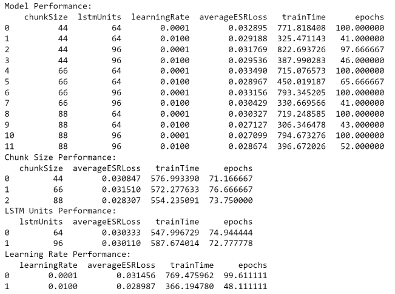

# SD-1/DS340
Boss SD-1 Modelling for DS340

## Overview
This was the first experiment of this project for my DS340 class.

This experiment aimed to model a Boss SD-1 at varying gain levels, but also to see how different model hyperparameters would influence modelling accuracy.

## Recording Settings

- Dry and Wet signals recorded at 20dB input at 44.1K Hz on Focusrite Scarlett 2i2 Gen 4
- Tone and Level knobs at Noon
- Low Gain: Drive at 9:00
- Mid Gain: Drive at 12:00
- High Gain: Drive at 3:00
    
## Training/Validation Data 
Data was split into context chunks of size n with no overlap. The x data was a single chunk of dry audio with size n, and the y data was the corresponding wet audio output sample.

[Training/Validation Data](../../../TrainValPickles/SD-1/DS340)

## Model Architecture
All models consisted of a single LSTM layer, fed into a single Dense layer.

## Hyperparameters
These hyperparameter combinations resulted in 36 models. 

Variable Hyperparameters:
  - Gain Levels on Boss SD-1: "Low", "Mid", "High"
  - Training/Validation Data Context Sizes: 44, 66, 88 samples (Corresponding to 1, 1.5, and 2 ms with a sample rate of 44.1K)
  - LSTM Hidden Unit Sizes: 64 and 96 units
  - Model Learning Rates: 0.01 and 0.0001

Fixed Hyperparameters:
  - Patience: 15
  - Batch Size: 64
  - Epochs: 100
  - Training Data Shuffled: True
  - Random State: 25
  - Sample Rate: 44.1K
  - All models trained on approximately 75K data samples relative to Context Size
  - Adam Optimizer used
  - Loss Function: ESR Loss

## Testing Data
All models were tested on [battery.wav](../../../Data/Inputs/battery.wav), [electricEye.wav](../../../Data/Inputs/electricEye.wav), [holywar.wav](../../../Data/Inputs/holywar.wav), [ohwell.wav](../../../Data/Inputs/ohwell.wav), [sanitarium.wav](../../../Data/Inputs/sanitarium.wav), and [shadowlove.wav](../../../Data/Inputs/shadowlove.wav). These were chosen for their diversity in speed and complexity. ESR loss for the model's predictions vs the true SD-1 output was saved. The output audio files were also saved.

## Results
All Results:

Summarized Hyperparameter Results:

## Conclusions

## Takeaways

